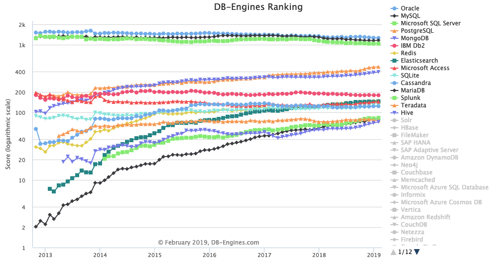
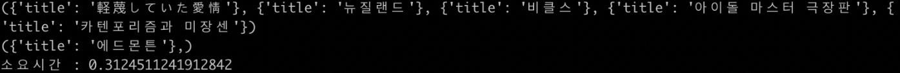

# RDBMS vs NoSQL (MySQL vs MongoDB)

> RDBMS와 NoSQL의 성능 차이 비교

<p></p>

하나의 프로젝트를 기획하는 도중에 DB를 선택해야하는 의사결정 시기에 맞이하면서 진행하게 된 실험입니다.

RDBMS의 대표적인 DB인 MySQL과 NoSQL의 MongoDB를 기준으로 테스트를 진행하였습니다.

테스트 순서는 기획 중인 프로젝트에서 주로 사용 될 쿼리를 중점으로 테스트를 진행하였습니다.

## Test sequence

- No Indexing VS Indexing
  - Int Type Compare (TEST 1)
  - String Type Compare (TEST 2)
    - Equal (동치 연산)
    - Regex (부분 연산)
  - Array Type Compare (TEST 3)
  - Order Speed Compare (TEST 4)

## Test environment

- Python 3.7.4
- MySQL 5.7.26
- MongoDB 4.0.3
- CPU : Intel I5 7267U
- RAM : 8GB
- DataSet : NamuWiki Data 250,000 Posts
  - MySQL과 MongoDB에 똑 같은 데이터 셋이 적용됨.


## TEST 1

### Query

```python
# MySQL INT Type TEST
start = time.time()
with MySQL_db.cursor() as cursor:
  sql = "SELECT title FROM post WHERE rand_num=%s;"
  for num in random:
    cursor.execute(sql, (num,))
    result = cursor.fetchall()
    print(result)
print("소요시간 : ", time.time() - start)
```

```python
# MongoDB INT Type TEST
start = time.time()
for num in random:
  result = list(mongoDB_col.find({'rand_num': num}, {'_id': 0, 'title': 1}))
  print(result)
print("소요시간 : ", time.time() - start)
```

### No Indexing Result

<p></p>

<p></p>

No Indexing의 INT Type 조회에서는 RDBMS의 MySQL이 더 빠르다는 것을 확인할 수 있었습니다.

첫 테스트인지라 확실하게 조회를 하고 있는지 확인하기 위하여, print() 구문을 추가하였으나, 이후 테스트에서는 이 또한 리소스 낭비이기 때문에 제외했습니다.

### Indexing Result

<p></p>

<p></p>

마찬가지로 Indexing의 INT Type 조회에서는 RDBMS의 MySQL이 더 빠르다는 것을 확인할 수 있었습니다.

아무래도 NoSQL의 특성상 구조화된 테이블이 아니기 때문에 뭔가 단일 필드 조회에서는 더 느리지 않았나 하는 생각이 들었다.


## TEST 2

## Equal TEST

### Query

```python
# MySQL String(Equal) Type TEST
start = time.time()
with MySQL_db.cursor() as cursor:
  sql = "SELECT title FROM post WHERE _text=%s;"
  print("MySQL string(Equal) TEST")
  cursor.execute(sql, (topic_str,))
  result = cursor.fetchall()
print("소요시간 : ", time.time() - start)
```

```python
# MongoDB String(Equal) Type TEST
start = time.time()
print("MongoDB string(Equal) TEST")
result = list(mongoDB_col.find({'_text': topic_str}, {'_id': 0, 'title': 1}))
print("소요시간 : ", time.time() - start)
```

### No Indexing Result

<p></p>

<p></p>

### Indexing Result

<p></p>

<p></p>

결과는 No Indexing 상황에서는 MongoDB가 더 빠르다는 것을 확인할 수 있었고, Indexing 상황에서는 MySQL이 더 빠르다는 것을 확인할 수 있었습니다.

(개인적으로 결과가 조금 모순적이라고 생각했습니다. Index적용이 안된 것인지 다시 한번 확인해보아도 Index적용은 되어있었습니다.)

## Regex TEST

### Query

```python
# MySQL String(Regex) Type TEST
start = time.time()
with MySQL_db.cursor() as cursor:
  sql = "SELECT COUNT(*) AS cnt FROM post WHERE _text LIKE %s;"
  print("MySQL string(Regex) TEST")
  for topic_one in topic:
    temp_topic = '%' + topic_one + '%'
    cursor.execute(sql, (temp_topic,))
    result = cursor.fetchone()
    print(topic_one, '의 개수: ', result['cnt'])
print("소요시간 : ", time.time() - start)
```

```python
# MongoDB String(Regex) Type TEST
start = time.time()
for topic_one in topic:
  result = mongoDB_col.find({'text': {'$regex': topic_one}}).count()
    print(topic_one, '의 개수: ', result)
print("소요시간 : ", time.time() - start)
```

### No Indexing Result

<p></p>

<p></p>

### Indexing Result

<p></p>

<p></p>

결과는 No Indexing / Indexing 둘 다 MongoDB가 더 빠르다는 것을 확인할 수 있었습니다.


## TEST 3

"ㅇㅇㅇ"의 단어를 포함하면서(AND), "ㅁㅁㅁ" 혹은(OR) "XXX"가 수정한 포스트를 찾아라.

라는 질의문을 기준으로 테스트를 진행했습니다.

### Query

```python
# MySQL Array(join) Type TEST
start = time.time()
with MySQL_db.cursor() as cursor:
  sql = "SELECT A.pt_id from (SELECT * FROM post WHERE _text LIKE %s) A JOIN (SELECT pt_id FROM post_contributors WHERE content=%s OR context=%s) B ON A.pt_id = B.pt_id;"
  print("MySQL Array(join) TEST")
  for topic_one in topic:
    temp_topic = '%' + topic_one + '%'
    for contributors in contributors_list:
      cursor.execute(sql, (temp_topic, contributors[0], contributors[1],))
      result = cursor.fetchone()
print("소요시간 : ", time.time() - start)
```

```python
# MongoDB Array(join) Type TEST
start = time.time()
for topic_one in topic:
  for contributors in contributors_list:
    result = mongoDB_col.find({'$and': [{'text': {'$regex': topic_one}},
                               '$or': [{'contributors': contributors[0], {'contributors': contributors[1]}}]]}).count()
print("소요시간 : ", time.time() - start)
```

### Result

<p></p>

<p></p>

결과는 MongoDB가 더 우세했습니다.

아무래도 리스트 자료형이 없는 RDBMS에게는 불리한 싸움이지 않았나 싶은 생각이 든다.

## Usage example

TEST Execution:

```sh
python3 test.py
```

Sort TEST Excution:

```sh
python3 sort_test.py
```

```sh
open ./temp.html
```

Development setup

```sh
make install
npm test
```

## Release History

* Only TEST

## Meta

🙋🏻‍♂️ Name: 837477 

📧 E-mail: 8374770@gmail.com

📔 Blog: http://837477.pythonanywhere.com

🐱 Github: https://github.com/837477

## Contributing

1. Fork it (<https://github.com/837477/XXXXXXX>)
2. Create your feature branch (`git checkout -b feature/fooBar`)
3. Commit your changes (`git commit -am 'Add some fooBar'`)
4. Push to the branch (`git push origin feature/fooBar`)
5. Create a new Pull Request
